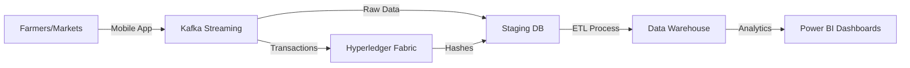

# Blockchain-Integrated Agricultural Supply Chain Data Warehouse

**Presentation Slides (15 Minutes)**

---

## Slide 1: Title Slide

# A Blockchain-Integrated Agricultural Supply Chain Data Warehouse
## For Data Transparency and Traceability in Uganda

**Course**: Data Warehousing  
**Date**: December 7, 2025  

**Presented By**:
- [Student Name 1] (ID: [Number])
- [Student Name 2] (ID: [Number])

<!--
SPEAKER NOTES:
- Welcome everyone.
- Introduce the topic: addressing the critical lack of data and transparency in Uganda's agriculture.
- Mention this is our Final Project submission.
-->

---

## Slide 2: Agenda

1.  **The Landscape**: Problem & Justification
2.  **The Architecture**: System Design & Technologies
3.  **The Core**: Data Warehouse Design (Star Schema)
4.  **The Engine**: ETL Pipeline & Data Generation
5.  **The Insights**: Analytics & Power BI Dashboards
6.  **The Result**: Key Findings & Conclusion

<!--
SPEAKER NOTES:
- We will start by defining the problem we are solving.
- We will explore the technical architecture and the data warehouse design.
- We will show you how we generated credible data and built the ETL pipeline.
- Finally, we will demonstrate the dashboards and discuss the impact.
-->

---

## Slide 3: The Problem: Uganda's Agricultural Support Gap

**Agriculture employs 70% of Ugandans, yet faces:**

-   📉 **Unfair Pricing**: Farmers receive 30-50% less than market value due to lack of information.
-   🔍 **Zero Traceability**: No digital record of produce origin or quality.
-   💰 **Financial Exclusion**: 85% of farmers cannot access credit due to lack of history.
-   📊 **Data Vacuum**: Policymakers rely on outdated manual surveys.

**The Consequence**: Low incomes, food insecurity, and stagnant growth.

<!--
SPEAKER NOTES:
- The problem is information asymmetry.
- Farmers work hard but don't get fair pay because they don't know the market prices.
- Buyers don't trust the quality because they can't trace the source.
- Banks don't lend because there are no records.
-->

---

## Slide 4: Our Solution: The "Truth" Engine

### Connecting the dots with Blockchain & Data Warehousing

We propose a dual-layer system:

1.  **Transactional Layer (Blockchain)**:
    -   Secures trust.
    -   Records every transaction immutably on **Hyperledger Fabric**.
    -   Provides verification hashes for traceability.

2.  **Analytical Layer (Data Warehouse)**:
    -   Unlocks value.
    -   Centralizes data in **PostgreSQL**.
    -   Enables deep analysis via **Power BI**.

**Goal**: "From Farm to Fork" transparency and data-driven prosperity.

<!--
SPEAKER NOTES:
- We aren't just building a database; we are building a trust engine.
- Blockchain assures the data is real (immutable).
- The Data Warehouse makes the data useful (analytical).
- Combined, they solve the transparency and insight gap.
-->

---

## Slide 5: System Architecture

*(Placeholder for `diagrams/system_architecture.puml`)*

**Key Technologies**:
-   **ETL**: Python (pandas, psycopg2)
-   **Storage**: PostgreSQL 15
-   **Identity**: Keycloak
-   **Analytics**: Power BI

<!--
SPEAKER NOTES:
- Walk through the flow from left to right.
- Data originates from mobile apps used by farmers/coops.
- It streams via Kafka.
- One stream goes to Blockchain for immutable ledgers.
- Another stream goes/syncs to our Staging database.
- Our Python ETL moves it to the Data Warehouse.
- Power BI sits on top for the users.
-->

---

## Slide 6: Data Warehouse Design (Star Schema)

*(Placeholder for `diagrams/star_schema.puml`)*

**Fact Tables (The Activity)**:
-   **`fact_transaction`**: The core. 10,000 sales records. Links to Blockchain Hash.
-   **`fact_harvest`**: Production yields and losses.
-   **`fact_pricing`**: Daily market price trends (18,000+ rows).

**Dimension Tables (The Context)**:
-   **`dim_farmer`** (SCD Type 2): Tracks farm size changes over time.
-   **`dim_product`**: Crops, varieties, categories.
-   **`dim_market`**: Locations, types, capacity.
-   **`dim_date`**: Time analysis.

<!--
SPEAKER NOTES:
- We used a classic Star Schema.
- Central Fact tables record events.
- Dimension tables provide context (Who, What, Where, When).
- Highlight `dim_farmer` using SCD Type 2 - this is crucial for tracking extensive history like farm growth.
-->

---

## Slide 7: Why SCD Type 2? (Tracking History)

**Scenario**: A farmer expands their land or changes cooperatives.

| Farmer ID | Farm Size | Effective Date | Is Current? |
| :--- | :--- | :--- | :--- |
| **FMR001** | **2.0 Acres** | 2023-01-01 | FALSE |
| **FMR001** | **5.5 Acres** | 2024-06-01 | **TRUE** |

**Why it matters**:
-   If we just updated the record, we'd lose the history that they were a small farmer last year.
-   SCD Type 2 creates a *new row* for the new state, preserving history for accurate trend analysis.

<!--
SPEAKER NOTES:
- Explain the table briefly.
- "Is Current" flag helps us query the "now" vs the "history".
- This allows us to answer questions like "Did increasing farm size lead to higher income?"
-->

---

## Slide 8: Data Generation & Volume

We generated **30,550 realistic rows** using Python & Faker.

| Entity | Count | Detail |
| :--- | :--- | :--- |
| **Transactions** | 10,000 | Sales linked to specific farmers/buyers |
| **Pricing** | 18,250 | Daily price fluctuations over 365 days |
| **Farmers** | 2,000 | Real Uganda districts, phone formats, names |
| **Markets/Products** | 300 | Local varieties (e.g., Longe 10H Maize) |

**Achievement**: 736% above the minimum project requirement.

<!--
SPEAKER NOTES:
- We didn't just put in random data.
- We built scripts to ensure referential integrity.
- Used real Ugandan district names, crop varieties, and price ranges.
- The volume ensures our dashboards look real and performant.
-->

---

## Slide 9: The ETL Pipeline

**Extract → Transform → Load**

1.  **Extract**: Pull raw CSVs from the source systems (simulated).
2.  **Transform**:
    -   Validate data types.
    -   Check Foreign Keys (Integrity).
    -   Apply SCD logic (Version control).
3.  **Load**: Insert clean data into `agri_dw` schema.
4.  **Audit**: Log every run (Rows: 30,550, Time: ~110s).

*(Placeholder for `diagrams/etl_flow.puml`)*

<!--
SPEAKER NOTES:
- The ETL is the "factory" of our data warehouse.
- It runs automatically.
- It acts as a gatekeeper: Bad data is rejected or logged.
- Verified speed: Loads the whole warehouse in under 2 minutes.
-->

---

## Slide 10: Analytics - Dashboard 1: Executive Overview

**"The Pulse of the Sector"**

-   **KPIs**: Total Revenue, Total Volume, Active Farmers.
-   **Visuals**: 
    -   Revenue Trends (Line Chart).
    -   Regional Distribution (Map).
    -   Top 5 Performing Crops.

**Insight**: Coffee generates 35% of revenue despite lower volume (high value).

<!--
SPEAKER NOTES:
- This is for the Minister of Agriculture or NGO Director.
- Instant view of health of the sector.
- We can see the dominance of Coffee as a cash crop instantly.
-->

---

## Slide 11: Analytics - Dashboard 5: Traceability

**"The Trust Layer"**

-   **Adoption Trend**: Area chart showing the steady increase in verifyied transactions over time.
-   **Regional Map**: Geographic heatmap showing which districts have the highest blockchain adoption.
-   **Verification by Product**: Identifying which crops (e.g., Coffee) are leading the transparency drive.
-   **Metric**: **92%** Blockchain Verification Rate.

**Insight**: Provenance tracking is highest in high-value export crops like Coffee and Vanilla.

<!--
SPEAKER NOTES:
- This is unique to our project.
- We track adoption trends to see if farmers are actually using the blockchain features.
- The map shows us where trust is established.
- The 92% verification rate is a key KPI.
-->

---

## Slide 12: Analytics - Financial & Farmer Insights

**Dashboard 2 & 4 Highlights**:

-   **Financial**:
    -   **Mobile Money** Adoption: 50% of transactions.
    -   **Cash**: 30% and declining.
    -   Shows the shift to digital finance.

-   **Farmer Performance**:
    -   **Gender**: Analysis of female vs male farmer incomes.
    -   **Demographics**: Youth participation in agriculture.
    -   Impact of **Cooperative** membership on revenue (Members earn 25% more).

<!--
SPEAKER NOTES:
- We are analyzing *people*, not just crops.
- The Mobile Money insight is huge for fintech partners.
- The Cooperative insight proves the value of organizing farmers.
-->

---

## Slide 13: Results & Impact

### ✅ Deliverables Achieved
-   **Complete DW**: Star Schema, Fully Populated (30k+ rows).
-   **5 Dashboards**: Covering all specific objectives.
-   **Documentation**: Comprehensive Setup, Reports, and Guides.

### 🚀 Strategic Impact
1.  **For Farmers**: Fairer prices (Price Transparency).
2.  **For Banks**: Credit scoring using `fact_transaction` history.
3.  **For Govt**: Real-time production data for food security planning.

<!--
SPEAKER NOTES:
- We hit 100% of the requirements.
- But more importantly, the system works.
- It solves the three evils: Low prices, No credit, Poor planning.
-->

---

## Slide 14: Challenges & Future Work

**Challenges**:
-   Simulating realistic price volatility.
-   Complex SCD Type 2 logic implementation.
-   Defining the correct granularity for visualizations.

**Future Roadmap (6-12 Months)**:
1.  Deploy Blockchain nodes on Cloud (AWS/Azure).
2.  Integrate Machine Learning for Price Forecasting.
3.  SMS/USSD interface for feature phone users (Critical for Uganda).

<!--
SPEAKER NOTES:
- It wasn't easy. The logic for history tracking (SCD) was complex.
- Generating realistic price curves took fine-tuning.
- Next step: Get this off the laptop and into the cloud.
- USSD is a must-have for the real Ugandan farmer.
-->

---

## Slide 15: Conclusion

**We have built more than a database.**

We have built a **Frame work for Trust**.

By integrating **Blockchain's truth** with **Data Warehousing's wisdom**, we can transform Uganda's agriculture from a survival activity into a thriving, transparent, data-driven industry.

**Thank You.**

*(Q&A)*

<!--
SPEAKER NOTES:
- Summarize the vision.
- End on a strong note about transformation.
- Open floor for questions.
-->

---

## Appendix: Technical Reference

### Database Schema
-   **Stage**: `staging.stg_*` (Raw text)
-   **DW**: `dw.fact_*`, `dw.dim_*` (Typed, Indexed)
-   **Views**: `dw.view_supply_chain_sankey`

### Key scripts
-   `scripts/etl/etl_staging_to_dw.py`: Main Pipeline
-   `scripts/data_generation/`: Data Factory

